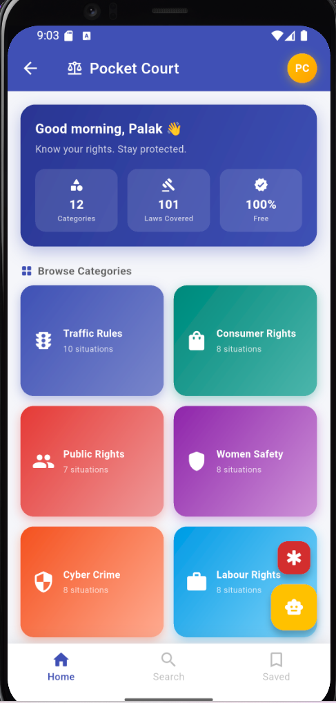
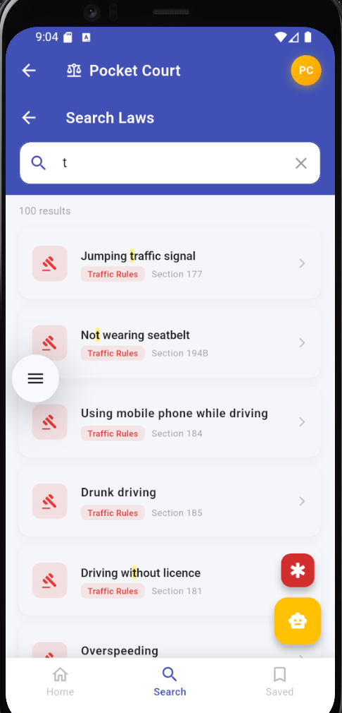
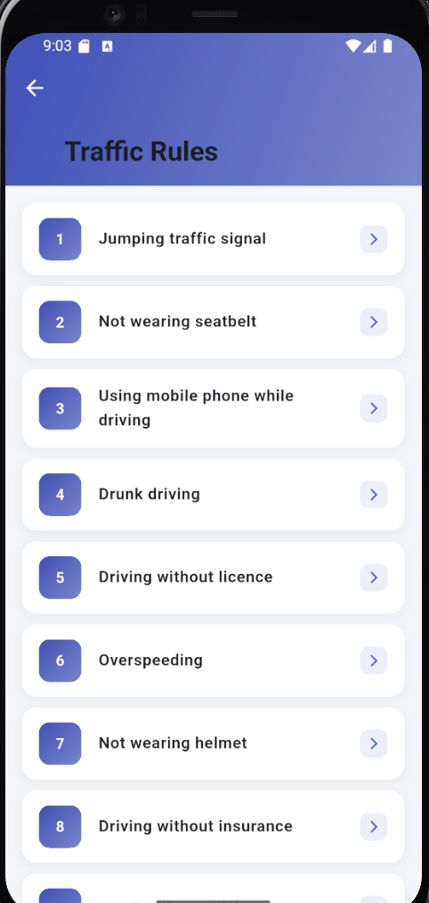
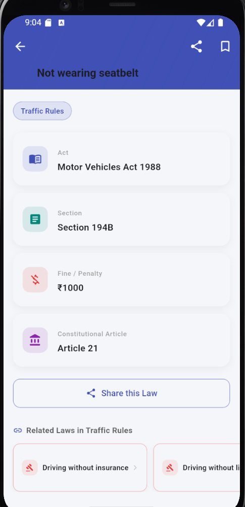
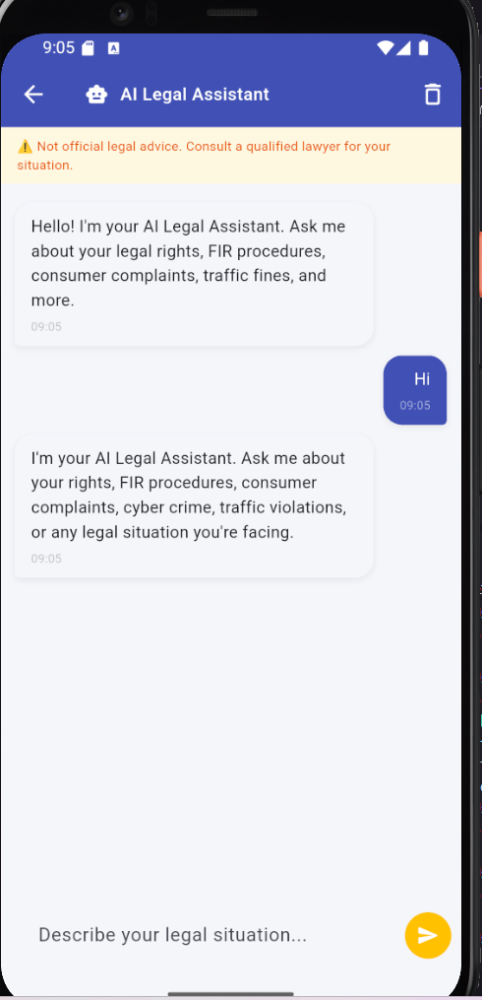
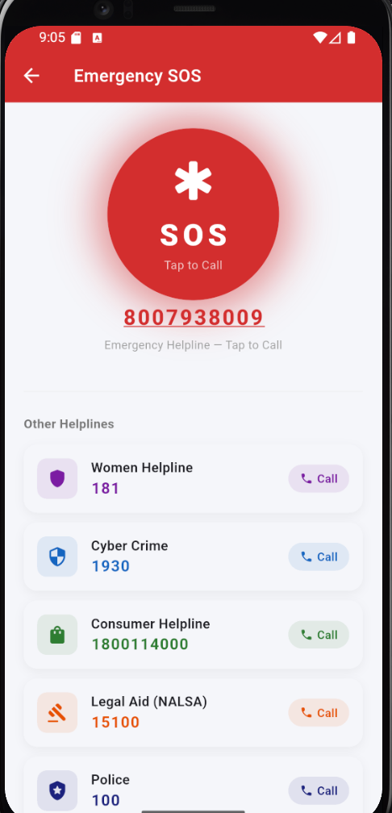
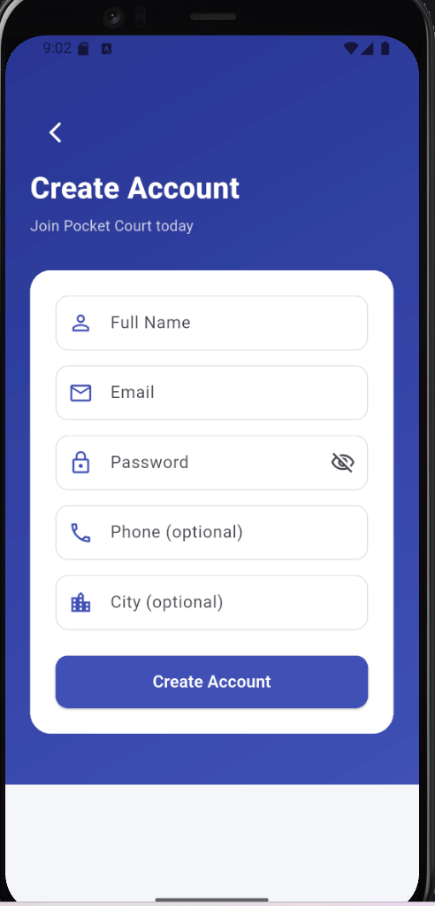
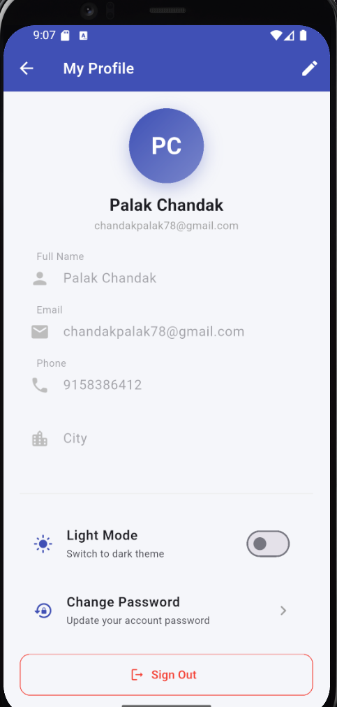

<div align="center">

# ⚖️ Pocket Court
### Know Your Rights. Stay Protected.

**A full-stack legal awareness mobile app for Indian citizens**  
Built with Flutter · Node.js · MongoDB · Gemini AI

[](https://flutter.dev)
[](https://nodejs.org)
[](https://mongodb.com)
[](https://aistudio.google.com)

</div>

---

## 📱 Screenshots

<div align="center">

| Home Screen | Search Laws | Situation List |
|:-----------:|:-----------:|:--------------:|
|  |  |  |

| Law Detail | AI Legal Assistant | Emergency SOS |
|:----------:|:-----------------:|:-------------:|
|  |  |  |

| Register | My Profile |
|:--------:|:---------:|
|  |  |

</div>

---

## 🌟 Features

### 📚 Legal Knowledge Base
- **101 Indian laws** across **12 categories** — Traffic Rules, Consumer Rights, Cyber Crime, Women Safety, Labour Rights, Banking Rights, Digital Payments & UPI Safety, Road Rage, Rental & Property Issues, Public Rights, Environmental Rights, Tenant Rights
- Each law includes the **Act name**, **Section**, **Fine/Penalty**, and **Constitutional Article**
- **Related Laws** suggestions on every detail screen

### 🔍 Smart Search
- Full-text search across situations, categories, acts, and sections
- **Text highlighting** on matched keywords
- **Persistent search history** (last 8 searches, swipe to delete)
- Popular search suggestions

### 🤖 AI Legal Assistant
- Powered by **Google Gemini 2.0 Flash** via secure backend proxy
- Understands both **Hindi and English**
- **Persistent chat history** across sessions
- Quick prompt suggestions for common legal questions
- Long-press any message to **copy to clipboard**
- Offline fallback responses for common queries

### 🚨 Emergency SOS
- Pulsing SOS button with **tap-to-call** functionality
- 6 helplines: Women (181), Cyber Crime (1930), Consumer (1800114000), Legal Aid (15100), Police (100), Ambulance (108)

### 🔖 Bookmarks
- Save laws for **offline access**
- **Category filter chips** to sort saved laws
- **Swipe to delete** with confirmation
- Synced with backend when logged in, local storage for guests

### 👤 User Authentication
- Register / Login / Guest mode
- **Password strength indicator** on registration
- **Change password** from profile
- Profile editing (name, phone, city)
- **Dark mode** with persistence

### 🔒 Security
- JWT authentication with 30-day tokens
- bcrypt password hashing (12 rounds)
- Rate limiting: 20 auth attempts / 15 min
- Gemini API key secured on backend — never exposed in app
- Input validation on all endpoints

---

## 🏗️ Tech Stack

### Frontend — Flutter
| Package | Purpose |
|---------|---------|
| `http` | API calls |
| `shared_preferences` | Local storage (bookmarks, history, theme) |
| `share_plus` | Native share sheet |
| `url_launcher` | Tap-to-call for SOS |

### Backend — Node.js + Express
| Package | Purpose |
|---------|---------|
| `express` | Web framework |
| `mongoose` | MongoDB ODM |
| `jsonwebtoken` | JWT authentication |
| `bcryptjs` | Password hashing |
| `cors` | Cross-origin requests |
| `express-rate-limit` | Brute force protection |
| `morgan` | Request logging |
| `dotenv` | Environment config |

### Database — MongoDB Atlas
- Compound index on `(category, situation)` for fast lookups
- Text index for full-text search
- Bookmarks stored per user

---

## 📁 Project Structure

```
Pocket-Court-App/
├── pocket-court-backend/          # Node.js REST API
│   ├── config/
│   │   └── db.js                  # MongoDB connection
│   ├── controllers/
│   │   ├── authController.js      # Register, login, profile, change password
│   │   ├── lawController.js       # Laws with pagination + search
│   │   ├── categoryController.js  # Categories and situations
│   │   ├── bookmarkController.js  # User bookmarks
│   │   └── aiController.js        # Gemini AI proxy
│   ├── middleware/
│   │   └── auth.js                # JWT verification
│   ├── models/
│   │   ├── User.js
│   │   ├── Law.js                 # With compound + text indexes
│   │   └── Category.js
│   ├── routes/
│   │   ├── authRoutes.js
│   │   ├── lawRoutes.js
│   │   ├── categoryRoutes.js
│   │   ├── bookmarkRoutes.js
│   │   └── aiRoutes.js
│   ├── server.js                  # Express app with CORS, rate limiting, error handling
│   ├── seed.js                    # Database seeder (101 laws)
│   └── .env.example
│
└── pocket_court_app/              # Flutter mobile app
    └── lib/
        ├── main.dart
        ├── main_navigation.dart
        ├── models/
        │   ├── law_model.dart
        │   ├── category_model.dart
        │   └── user_model.dart
        ├── screens/
        │   ├── home_screen.dart
        │   ├── search_screen.dart
        │   ├── bookmark_screen.dart
        │   ├── law_detail_screen.dart
        │   ├── situation_list_screen.dart
        │   ├── ai_chat_screen.dart
        │   ├── sos_screen.dart
        │   ├── profile_screen.dart
        │   └── auth/
        │       ├── login_screen.dart
        │       └── register_screen.dart
        ├── services/
        │   ├── api_service.dart
        │   ├── auth_service.dart
        │   ├── bookmark_service.dart
        │   ├── ai_service.dart
        │   └── theme_service.dart
        ├── theme/
        │   └── app_theme.dart
        └── widgets/
            ├── app_transitions.dart
            └── error_view.dart
```

---

## 🚀 Getting Started

### Prerequisites

```
Node.js v18+
Flutter SDK 3.x
Android Studio (with emulator) or physical Android device
MongoDB Atlas account (free)
Google Gemini API key (free)
```

### 1. Clone the repository

```bash
git clone https://github.com/palakchandak261/Pocket-Court-App.git
cd Pocket-Court-App
```

### 2. Set up the Backend

```bash
cd pocket-court-backend
npm install
cp .env.example .env
```

Edit `.env` with your values:

```env
MONGO_URI=mongodb+srv://<user>:<password>@cluster.mongodb.net/pocketcourt
PORT=5000
NODE_ENV=development
JWT_SECRET=your_long_random_secret_key_here
GEMINI_API_KEY=your_gemini_api_key_here
```

> **Get MongoDB Atlas free:** [cloud.mongodb.com](https://cloud.mongodb.com)  
> **Get Gemini API key free:** [aistudio.google.com](https://aistudio.google.com)

```bash
# Seed the database with all 101 laws
npm run seed

# Start the backend
npm run dev
```

You should see:
```
MongoDB Connected: cluster.mongodb.net
🚀 Server running on port 5000 [development]
```

### 3. Run the Flutter App

```bash
cd pocket_court_app
flutter pub get
flutter run
```

> **Android Emulator** — uses `10.0.2.2:5000` automatically (already configured)  
> **Physical Device** — update `baseUrl` in `lib/services/api_service.dart` to your LAN IP

---

## 🌐 API Endpoints

### Auth
| Method | Endpoint | Auth | Description |
|--------|----------|------|-------------|
| POST | `/api/auth/register` | ❌ | Create account |
| POST | `/api/auth/login` | ❌ | Login |
| GET | `/api/auth/me` | ✅ | Get current user |
| PUT | `/api/auth/profile` | ✅ | Update profile |
| PUT | `/api/auth/change-password` | ✅ | Change password |

### Laws
| Method | Endpoint | Auth | Description |
|--------|----------|------|-------------|
| GET | `/api/categories` | ❌ | All categories |
| GET | `/api/situations/:category` | ❌ | Situations in category |
| GET | `/api/law?category=X&situation=Y` | ❌ | Single law |
| GET | `/api/laws?page=1&limit=50&q=search` | ❌ | All laws (paginated + searchable) |

### Bookmarks
| Method | Endpoint | Auth | Description |
|--------|----------|------|-------------|
| GET | `/api/bookmarks` | ✅ | Get user bookmarks |
| POST | `/api/bookmarks` | ✅ | Add bookmark |
| DELETE | `/api/bookmarks` | ✅ | Remove bookmark |

### AI
| Method | Endpoint | Auth | Description |
|--------|----------|------|-------------|
| POST | `/api/ai/chat` | ❌ | AI legal assistant |

---

## 📦 Build APK

```bash
cd pocket_court_app
flutter build apk --release
```

APK location: `build/app/outputs/flutter-apk/app-release.apk`

---

## 🚢 Deployment

| Service | Platform | Cost |
|---------|----------|------|
| Backend | [Render](https://render.com) | Free |
| Database | [MongoDB Atlas](https://cloud.mongodb.com) | Free (512MB) |
| Flutter App | APK / Google Play Store | Free / $25 one-time |

After deploying backend to Render, update `api_service.dart`:
```dart
return 'https://your-app.onrender.com/api';
```

---

## 👩‍💻 Developer

**Palak Chandak**  
[](https://github.com/palakchandak261)

---

<div align="center">

**⚖️ Pocket Court — Empowering every Indian citizen with legal awareness**

*This app provides general legal awareness only. It is not a substitute for professional legal advice.*

</div>
